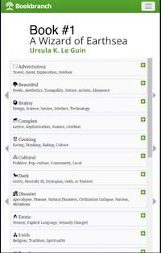
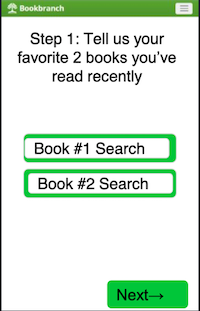

[](https://github.com/dmoreyPDX/bookbranch/blob/master/LICENSE.md)
# BookBranch
## Team A Spring / Summer 2019 Capstone
Sponsored by Dan Hahn

Cross platform mobile app for Easier Book Discovery and Review
Inspired from BookBranch.ch


### Prerequisites

What things you need to install the software and how to install them

### Installing
>cd bookbranch

>npm install react-native@0.59.8

>npm install -g react-native-cli

>react-native link @react-native-community/async-storage

### Facebook Authentication
Install the `react-native-fbsdk` package:
```
npm install github:facebook/react-native-fbsdk#5fe8e726966faf83d3388af85dd9740f4015e5d6
```
Once installed, run the following to link this
library to our React Native project:
```
react-native link react-native-fbsdk
```
Next, Download and unzip the Facebook SDK outside 
the repo (I store it in my Documents directory).
You can Find the SDK at `https://origincache.facebook.com/developers/resources/?id=facebook-ios-sdk-current.zip`

Open xcode and drag the following files from the 
facebook SDK folder into the framework folder
(don't copy the framework files as that would
increase the size of our repo):
- `Bolts.framework`
- `FBSDKCoreKit.framework`
- `FBSDKLoginKit.framework`
- `FBSDKShareKit.framework`

Finally, under Build Settings add the following 
path to Framework Search Paths:
```
$(HOME)/Documents/FacebookSDK # Or wherever you store your framework files
```

#### For IOS
>react-native run-ios

#### For Android
>react-native run-android


#### Documentation 
>https://facebook.github.io/react-native/docs/getting-started

>https://github.com/react-native-community/async-storage





